# 基于Spring Boot、Spring Cloud的领域驱动设计实践

此项目是《实现领域驱动设计》（IMPLEMENTING DOMAIN-DRIVEN DESIGN)
书籍的实践，将其落地于基于最新的SpringBoot、SpringCloud框架和Spock测试框架。

## 进度（概念完成度）

1. 领域、子域和界限上下文✖
2. 上下文映射图✖
3. 架构✖
4. 实体✔
5. 值对象✔
6. 领域服务✔
7. 领域事件✔
8. 模块✔
9. 聚合✔
10. 工厂✔
11. 资源库✔
12. 集成限界上下文✖
13. 应用程序✔
14. 聚合与事件溯源（该部分会在Axon（DDD）框架分支详解 ）

## 使用方式
1. 启动`IdentityAccessApplication`应用
2. 端口：`24000`
3. H2数据：http://localhost:24000/h2-console
   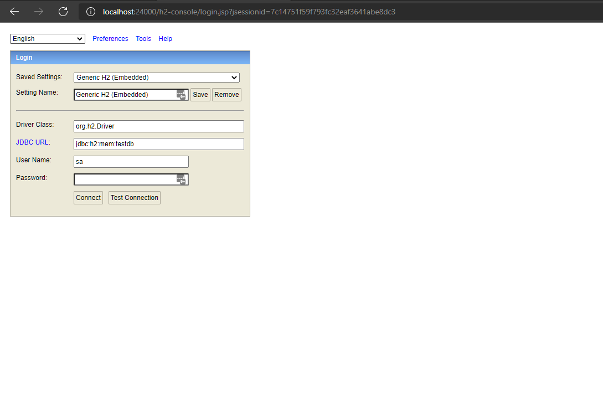
   直接连接：
   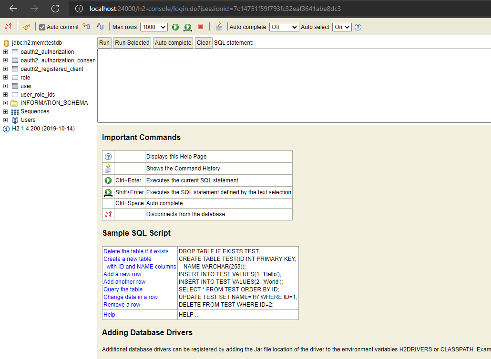
   查询内置数据：
   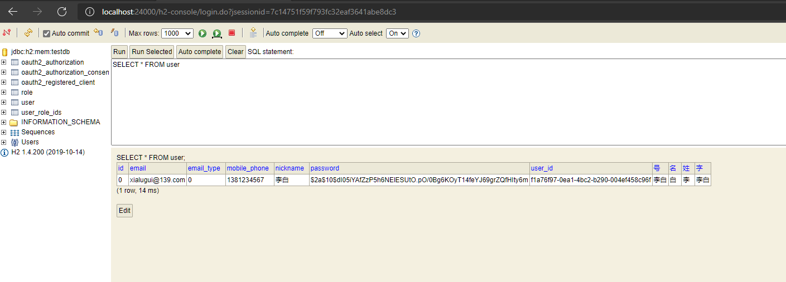
4. 接口文档：http://localhost:24000/swagger-ui.html
   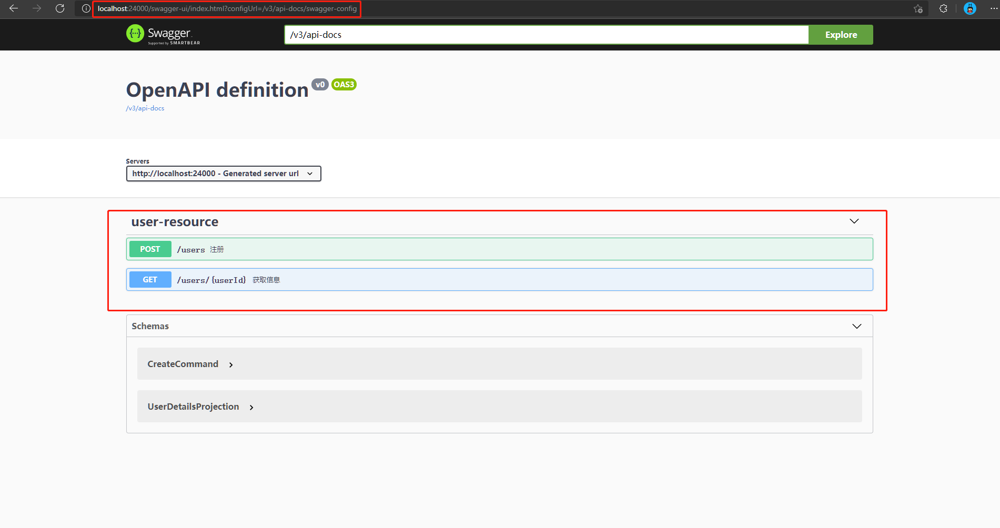
   目前仅有注册和获取信息两个接口，以注册为例：
   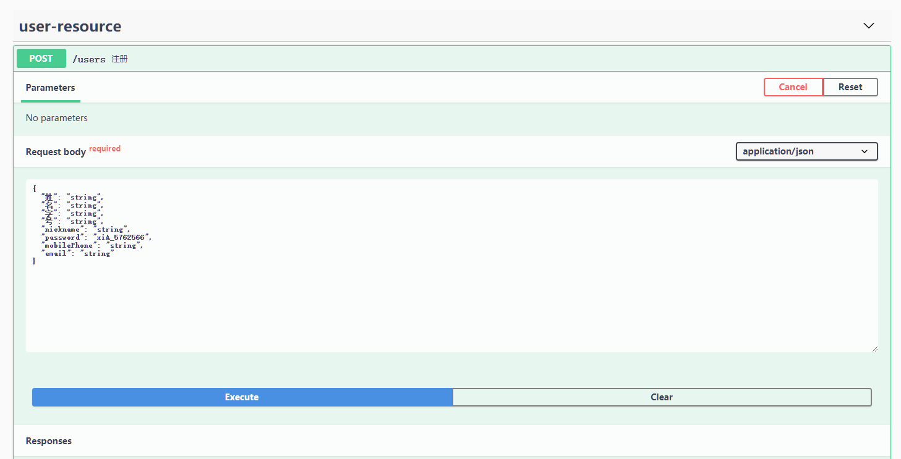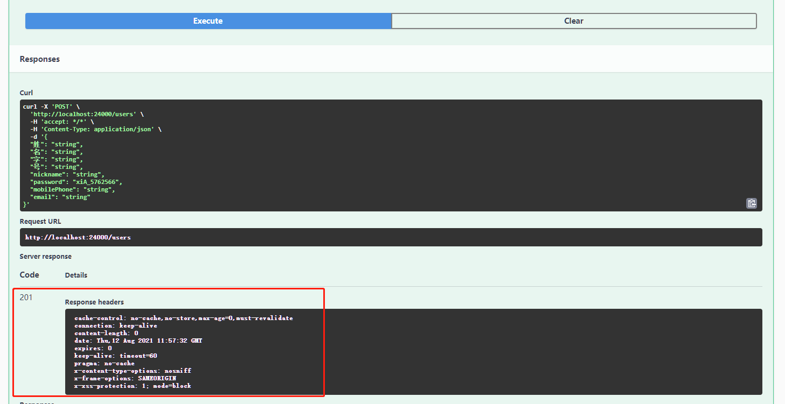
   因采用实验版本的授权服务器，目前swagger文档仅支持注册，其它接口
   建议使用postman进行测试。
5. 根据接口熟悉内部流程：
   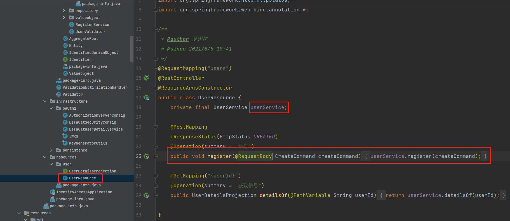

6. 查看每个模块包的`package-info.java`
   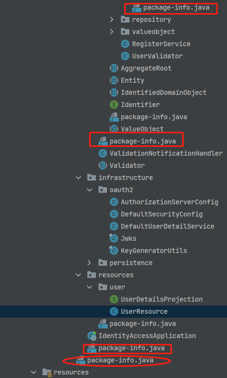
   每个包的信息文件会仔细介绍DDD相应概念。
7. `postman`测试环境。

[软件下载][postman]

[测试用例][postman-test]

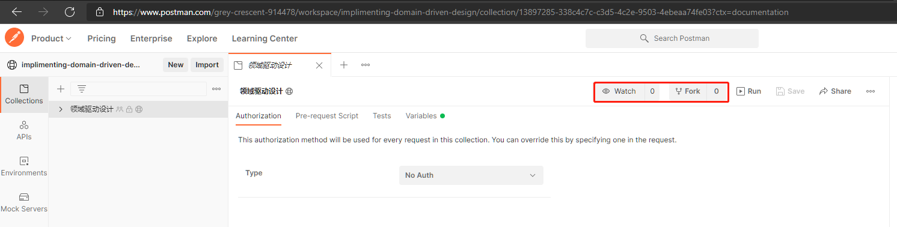

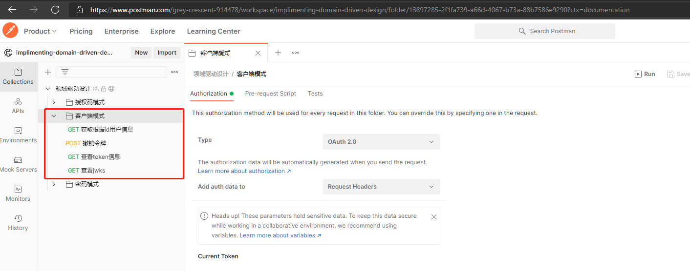使用客户端模式测试即可，接口测试说明：
1. 获取token
   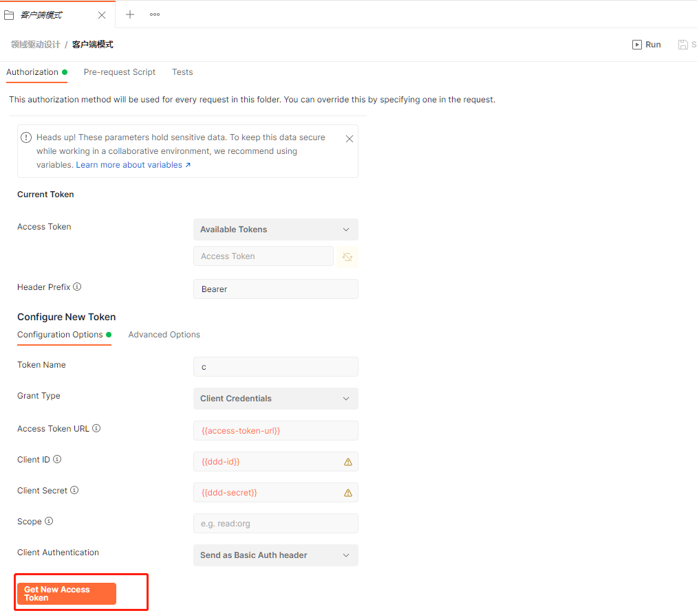
2. 设置token
   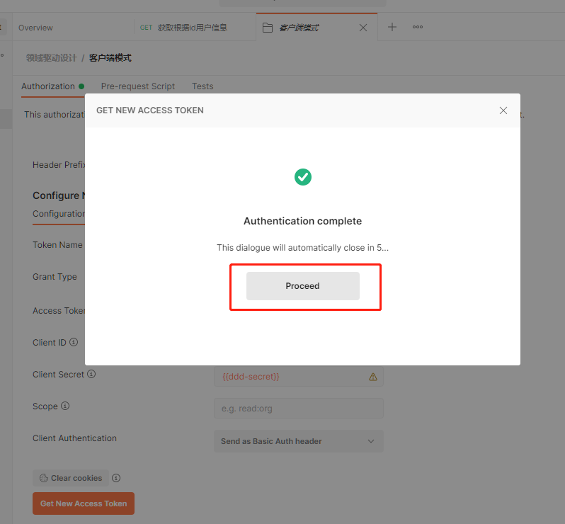
   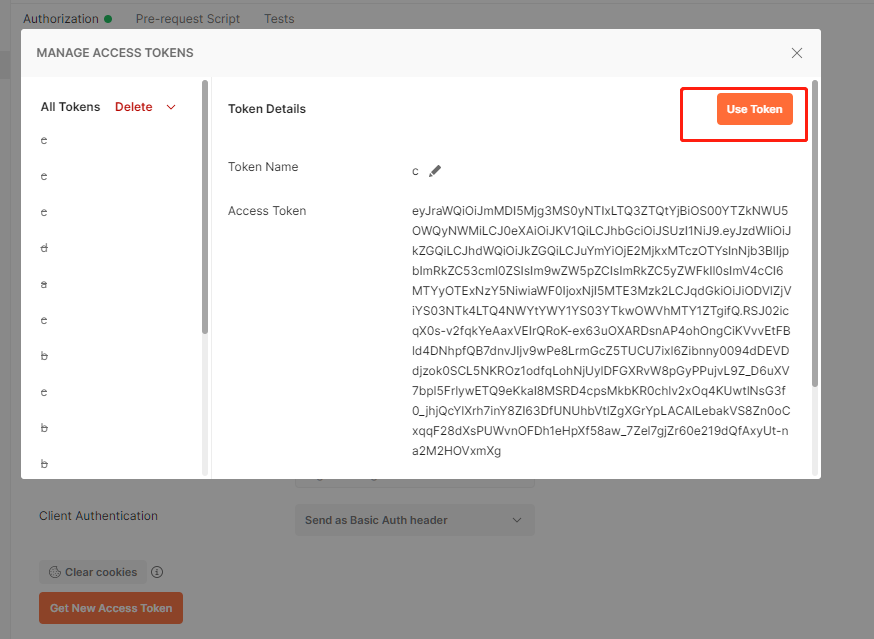
3. 获取信息
   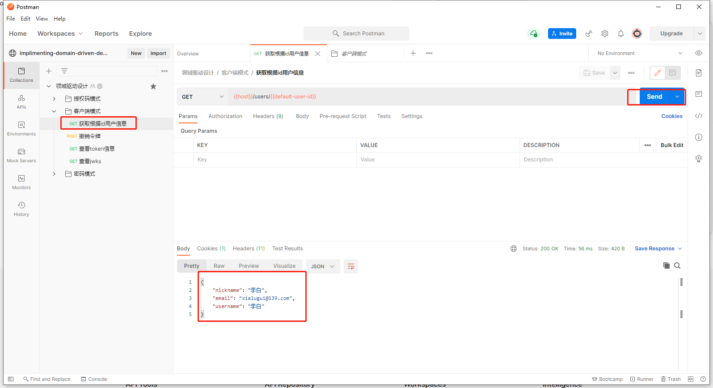

### package-info
每个包都对应DDD的概念，如

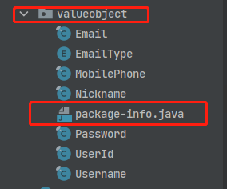

`valueobject`对应的是值对象，其`package-info`便是值对象的概念详解：
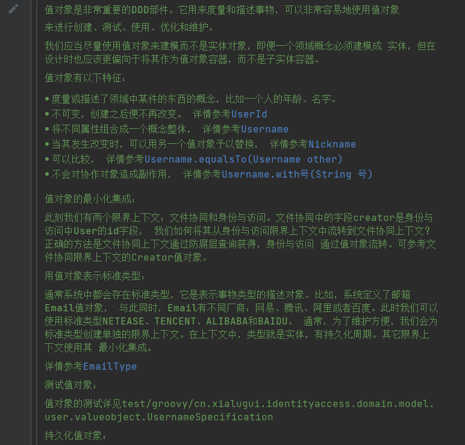
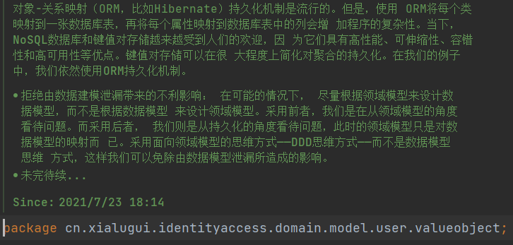

对概念的实例应用会被蓝字标注：
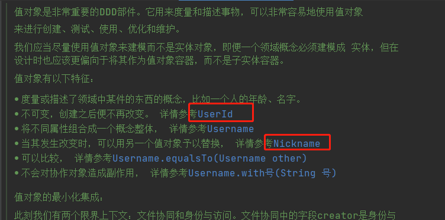
可跳转直达：

点击
⏬
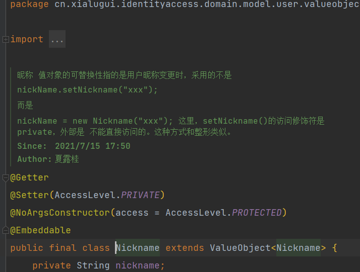
。

此举意在将理论落实到实际，讨论清楚为什么会采用代码中的方法，对实际编码的
好处，及其其它可行的方法，而不是为DDD 而DDD。

## 书籍信息

### 封面

### 在线浏览

提供可供在线浏览的PDF版本，同时支持下载（文件较大，176.10M）

[点击浏览、下载][ddd-implementation]

## 限界上下文

### 身份与访问

第一个限界上下文是身份与访问上下文，是身份与访问问题空间对应的解决方案。此部分将 全面详细的介绍领域驱动设计的相关概念，其中包括：

### 文件协同

第二个限界上下文是文件协同。

#### 模块

1. 模块的基本命名规范。
2. 领域模型的命名规范。
3. 其他层中的模块。

#### 值对象

1. 值对象的特征
    1. 不度量或描述。
    2. 不可变性。
    3. 概念整体。
    4. 值对象相等性。
    5. 无副作用行为。
2. 最小化集成
3. 用值对象表示标准类型
4. 测试值对象
5. 持久化值对象

#### 实体
1. 唯一标识
    1. 应用程序生成唯一标识
    2. 持久化机制生成唯一标识
    3. 另一个限界上下文提供标识
    4. 标识生成时间
    5. 委派标识
    6. 标识稳定性

2. 发现实体及其本质特征
    1. 揭开实体及其本质特征的神秘面纱
    2. 挖掘实体的关键行为
    3. 角色和职责
    4. 领域对象扮演多种角色
    5. 创建实体
    6. 验证
    7. 验证整体对象
    8. 验证对象组合

## 工具

### 测试驱动

#### 测试框架-Spock

Spock是基于Groovy语言的Java测试框架，是Junit的超集。简化了断言，添加了 函数名的自然语言支持，同是也是行为驱动开发（BDD）的工具。

详情可参考：[Spock官网][spock]

也可参考我的翻译：[点击直达][yuque-spock]
##### 测试文件位置
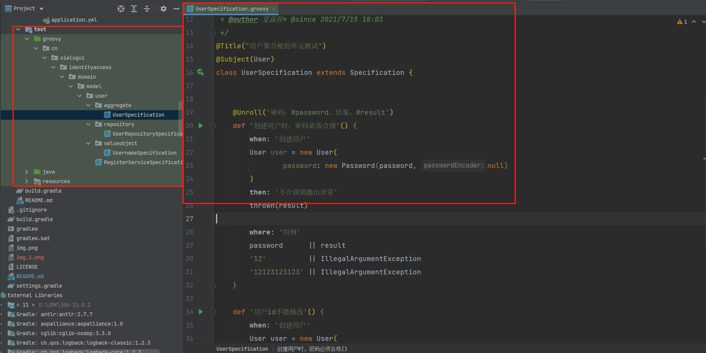
# 参考资料

1. [实现领域驱动设计][ddd-implementation]

[Spock]: https://spockframework.org/

[yuque-spock]: https://www.yuque.com/lugew/spock

[ddd-implementation]: https://kdocs.cn/l/sbM4tTbSgK6m

[postman]: https://www.postman.com/

[postman-test]: https://www.postman.com/grey-crescent-914478/workspace/implimenting-domain-driven-desi~b2c62ddc-0a3c-4cf7-b850-15476a40b9ad/collection/13897285-338c4c7c-c3d5-4c2e-9503-4ebeaa74fe03