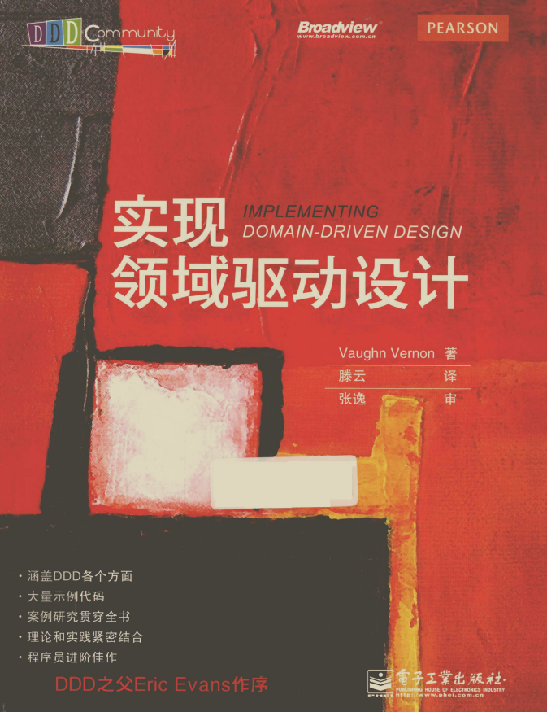

# 基于Spring Boot、Spring Cloud的领域驱动设计实践

此项目是《实现领域驱动设计》（IMPLEMENTING DOMAIN-DRIVEN DESIGN)
书籍的实践，将其落地于基于最新的SpringBoot、SpringCloud框架和Spock测试框架。

## 进度（概念完成度）

1. 领域、子域和界限上下文✖
2. 上下文映射图✖
3. 架构✖
4. 实体✖
5. 值对象✔
6. 领域服务✔
7. 领域事件✖
8. 模块✔
9. 聚合✔
10. 工厂✖
11. 资源库✔
12. 集成限界上下文✖
13. 应用程序✔
14. 聚合与事件溯源✖

## 书籍信息

### 封面

### 在线浏览

提供可供在线浏览的PDF版本，同时支持下载（文件较大，176.10M）

[点击浏览、下载][ddd-implementation]

## 限界上下文

### 身份与访问

第一个限界上下文是身份与访问上下文，是身份与访问问题空间对应的解决方案。此部分将 全面详细的介绍领域驱动设计的相关概念，其中包括：

1. 模块
    1. 模块的基本命名规范。
    2. 领域模型的命名规范。
    3. 其他层中的模块。

2. 值对象
    1. 值对象的特征
        1. 不度量或描述。
        2. 不可变性。
        3. 概念整体。
        4. 值对象相等性。
        5. 无副作用行为。
    2. 最小化集成
    3. 用值对象表示标准类型
    4. 测试值对象
    5. 持久化值对象

#### 模块

1. 传统模块和新的部署模块化之间的区别。
2. 通过通用语言来命名模块的重要性。
3. 机械式模块划分给建模带来的阻碍。
4. 其他层中的模块。

#### 值对象

1. 将一个领域概念建模成值对象。
1. 通过值对象来简化集成的复杂性。
1. 以值对象来创建领域标准类型。
1. 值对象的重要性的。
1. 如何测试、实现和持久化值对象的

## 工具

### 测试驱动

#### 测试框架-Spock

Spock是基于Groovy语言的Java测试框架，是Junit的超集。简化了断言，添加了 函数名的自然语言支持，同是也是行为驱动开发（BDD）的工具。

详情可参考：[Spock官网][spock]

也可参考我的翻译：[点击直达][yuque-spock]

# 参考资料

1. [实现领域驱动设计][ddd-implementation]

[Spock]: https://spockframework.org/

[yuque-spock]: https://www.yuque.com/lugew/spock

[ddd-implementation]: https://kdocs.cn/l/sbM4tTbSgK6m